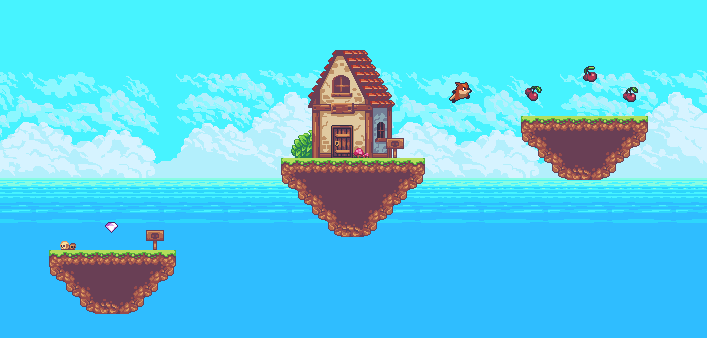

# Run Foxy Run!
Runner game based on Godot game engine and C# language.
The purpose of the program to learn and practice godot and to make some satisfaction on finishing stuff.

## Stack
* Godot v3.4.4
* C#/Mono

# License
* Source Code
    * Well its mine!
    * [MIT License](LICENSE)
* Graphics
  * [Sunny Land](https://ansimuz.itch.io/sunny-land-pixel-game-art) 
    * Thank you Ansimuz for the great assets that inspired me to create this game!

# Project Activity (based on main branch) 
